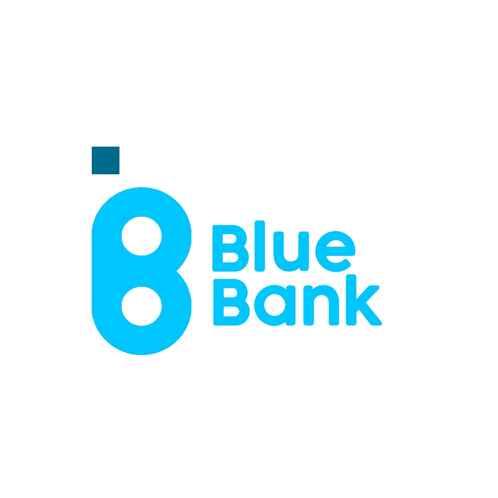

  

Uma API para gerenciar as transações de um banco fictício utilizando Java, MySQL e AWS, sendo o projeto final do Bootcamp da Pan Academy.

### REQUISITOS DO PROJETO

O sistema deve permitir cadastro de novos clientes, incluindo dados pessoais e
para contato, o cliente deve ser atrelado a uma conta bancária e deve-se ter o registro
do histórico de transações entre as contas.

##### SUGESTÃO DE ORGANIZAÇÃO DO PROJETO

1. Elaboração do kanban (sugestão de utilização: Trello ou Jira)
2. Criação do backlog (com tarefas referente ao desenvolvimento)
3. Detalhamento descritivo das tarefas da squad dentro dos seus cards (e não apenas com títulos genéricos no card)
4. Formatação do kanban padrão "to do, doing, done"
5. Definição de data de entrega das tarefas nos cards
6. Definição de responsável pelo card ou checklist de completude
7. Priorização dos cards (ex: tags com cores para maior relevância ou com títulos descritivos para nível de importância na priorização)

##### ENTREGAS MÍNIMAS

1. Metodologias Ágeis:
- Kanban com todas as tarefas organizadas e responsáveis definidos.

2. Back-end:
-  Cadastro de clientes
- Listagem de clientes
- Atualização de clientes
- Deletar clientes
- Histórico de transações entre contas

3. Banco de Dados:
- Tabelas bem estruturadas e populadas com valores para testes.
- O Banco deve ser entregue em script SQL junto ao repositório.

4. Gerais:
- O código deve ser entregue em um repositório no Github.
- A API deve ser disponibilizada em ambiente AWS com EC2 e em Beanstalk.
- A aplicação deve ter um pipeline em Jenkins ou no Aws Build.
- A aplicação precisa ser configurada no API Gateway da AWS.
- A aplicação precisa ter no mínimo um endpoint de SNS para cadastro de emails e verificação automática.
- A aplicação precisa ter no mínimo um Lambda.
- Liste os endpoints no README.md

### DESENVOLVIMENTO

#### QUADRO KANBAN

Efetuamos a aplicação por meio de Spring Boot, usando Maven, com CRUD e dividindo os as funções em microserviços, o banco de dados usado foi o MySql com deploy no Docker e pipeline em Jenkins, sendo o servidor usado para manter a aplicação  a AWS por meio da instância EC2.

### EXECUÇÃO DOS TESTES

### ANÁLISE DOS RESULTADOS

### FERRAMENTAS UTILIZADAS

* [Java SE 11](https://www.oracle.com/br/java/technologies/javase/jdk11-archive-downloads.html) 
* [Spring Tools](https://spring.io/tools#suite-three)
* [Beaver – Universal Database Tool](https://dbeaver.io/download/)
* [Postman API Platform](https://www.postman.com/downloads/)
* [XAMPP](https://www.apachefriends.org/pt_br/index.html)
* [Docker](https://www.docker.com/get-started)
* [Jenkins](https://www.jenkins.io/download/)

### AUTORES

#### Squad DEZKTOP
1. **Ivan Cardoso Monteiro Costa**
* Github: [ivancmc](https://github.com/ivancmc)
* Linkedin: 
2. **Luana dos Santos Nascimento**
* Github: [LuanaSantosNascimento](https://github.com/LuanaSantosNascimento)
* Linkedin: 
3. **Lucas Rodrigues**
* Github: [lucas-rl](https://github.com/lucas-rl)
* Linkedin: 
4. **Mayckon Morian Marqui Prado**
 * Github: [Mayckon-Prado](https://github.com/Mayckon-Prado)
* Linkedin: [Mayckon Prado](https://www.linkedin.com/in/mayckon-morian-marqui-prado-a9195571/)
5. **Wendel Dantas Lima**
* Github: [dantaswendel](https://github.com/dantaswendel)
* Linkedin: 

###  LICENÇA

Este projeto está sob a licença MIT.

### AGRADECIMENTO

