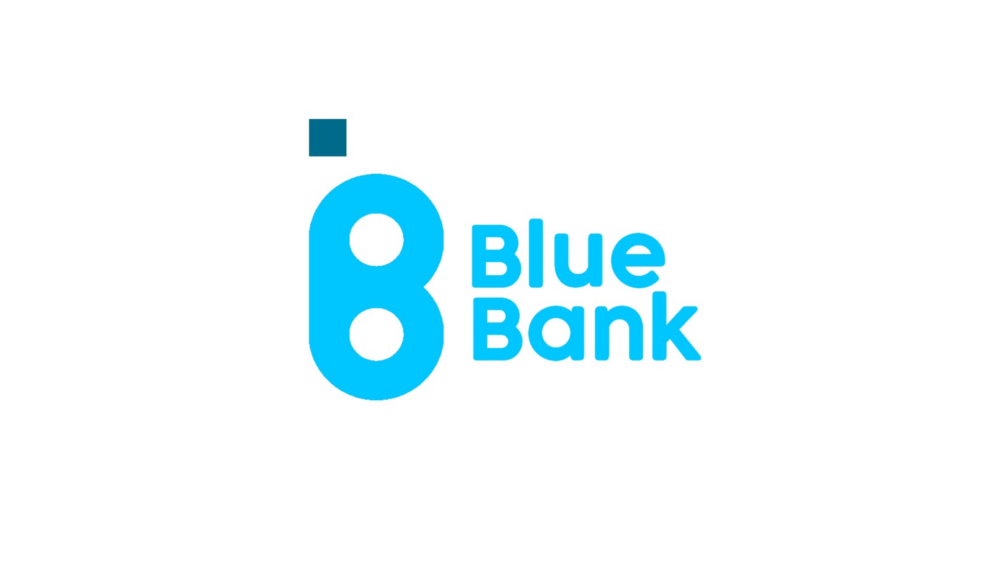
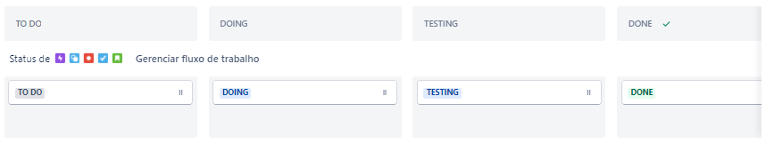
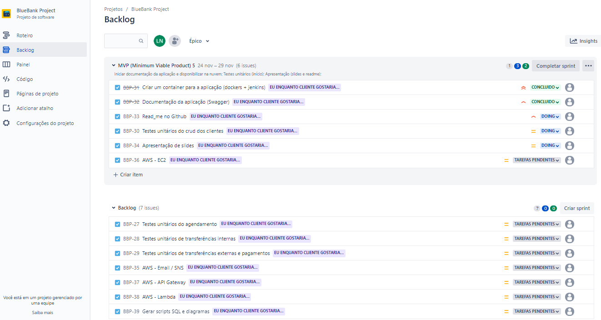
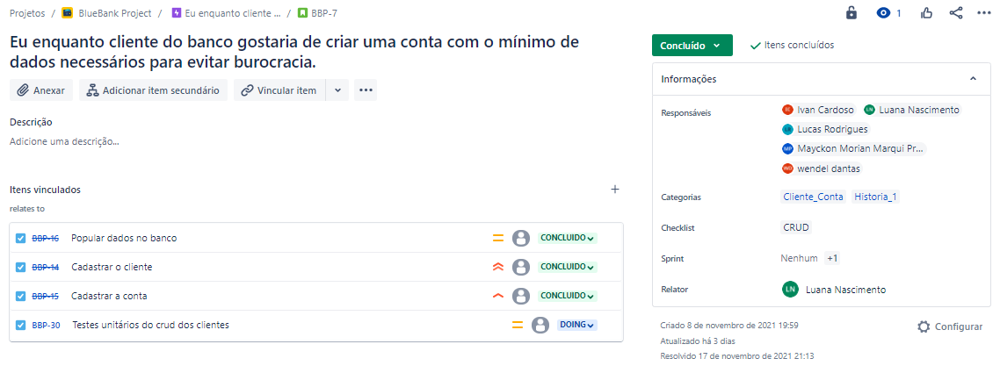
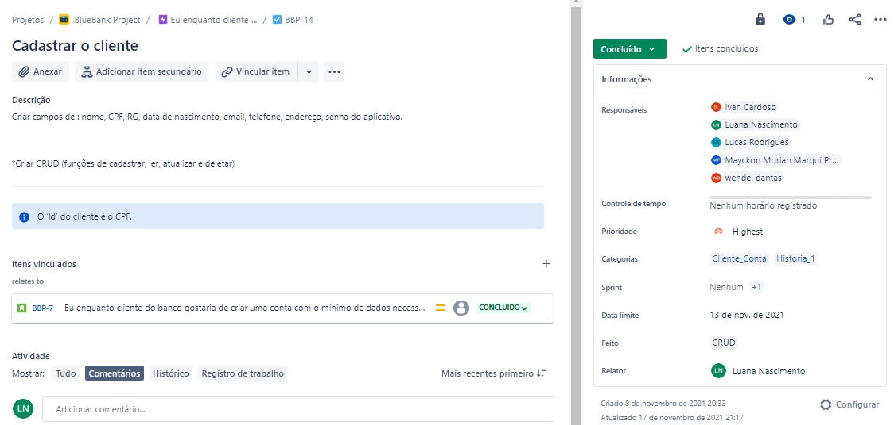
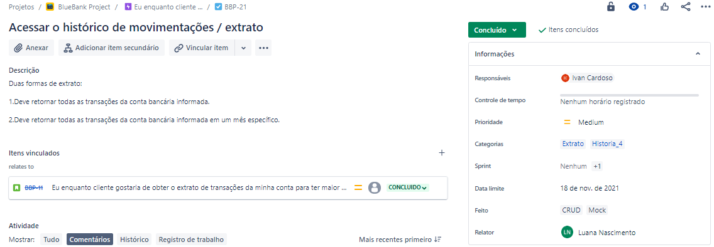
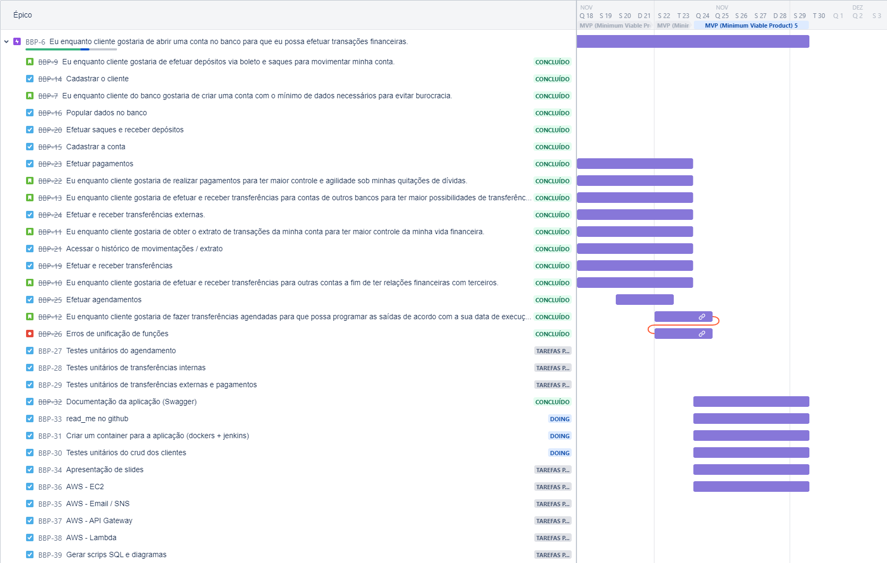
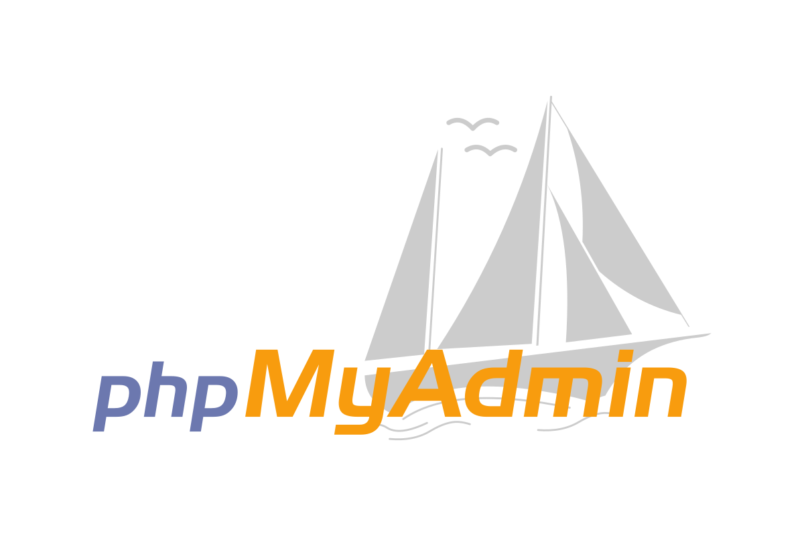

</img>
<h1 align="center" id="topo">Olá, seja bem vindo(a) a API Bluebank</h1>
Esse projeto consiste em uma API para gerenciar as transações de um banco fictício utilizando Java, MySQL e AWS. Efetuamos a aplicação por meio de Spring Boot, usando Maven com CRUD e dividimos as funções em microserviços. Para o banco de dados utilizamos o MySql com deploy no Docker e pipeline em Jenkins, e por fim, fizemos uso da AWS como servidor para manter a aplicação por meio da instância EC2.

<h3>Sumário</h3>
<ul>
	
	<li><a href="#requisitos">Requisitos e Funcionalidades</a></li>
	<ul>
		<li><a href="#RQEntrega">Requisitos de Entrega</a></li>
        <li><a href="#RQFuncionais">Requisitos Funcionais</a></li>
        <li><a href="#endpoints">Endpoints</a></li>
        <ul>
            <li><a href="#postman">Postman</a></li>
            <li><a href="#swagger">Swagger</a></li>
        </ul>
    </ul>
    <li><a href="#desenvolvimento">Processo de Desenvolvimento</a></li>
    <ul>
        <li><a href="#jira">Quadro Kanban</a></li>
        <li><a href="#testes">Execução dos Testes</a></li>
    </ul>
    <li><a href="#tecnologias">Tecnologias e Ferramentas</a></li>
    <li><a href="#licenca">Licença</a></li>
    <li><a href="#agradecimentos">Agradecimentos</a></li>
    <li><a href="#squad">Squad DezKTop</a></li>
</ul>

<h1 align="center" id="requisitos">Requisitos e Funcionalidades</h1>
<h3 id="RQEntrega">Requisitos de Entrega</h3>

- [ ] O código deve ser entregue em um repositório no Github.
- [ ] A API deve ser disponibilizada em ambiente AWS com EC2 e em Beanstalk.
- [ ] A aplicação deve ter um pipeline em Jenkins ou no Aws Build.
- [ ] A aplicação precisa ser configurada no API Gateway da AWS.
- [ ] A aplicação precisa ter no mínimo um endpoint de SNS para cadastro de emails e verificação automática.
- [ ] A aplicação precisa ter no mínimo um Lambda.
- [ ] Liste os endpoints no README.md
- [ ] O Banco deve ser entregue em script SQL junto ao repositório.

<h3 id="RQFuncionais">Requisitos Funcionais</h3>
Os requisitos funcionais desta API giram em torno de um CRUD entre clientes e suas respectivas contas bancárias, logo, este sistema possibilita:

- O cadastro de clientes - Incluindo dados pessoais e informações para contato.
- A listagem de clientes - Você pode optar por listar todos os clientes existentes na base de dados ou buscar um em específico.
- A atualização de dados dos clientes.
- A exclusão de um cliente, e consequentemente de sua conta bancária.
- O histórico de transações entre contas.

<h3 id="endpoints">Endpoints</h3>
Essa seção encontra-se em desenvolvimento.

<h3 id="postman">Postman</h3>
Essa seção encontra-se em desenvolvimento.

<h3 id="swagger">Swagger</h3>
Essa seção encontra-se em desenvolvimento.

<a href="#topo">Você pode voltar ao topo clicando aqui ↑</a>

<h1 id="desenvolvimento" align="center">Desenvolvimento</h1>
<h3 id="jira">Quadro Kanban</h3>
Para a organização do projeto, utilizamos o <a href="https://www.atlassian.com/br/software/jira">Jira</a> e criamos um quadro <a href="https://www.atlassian.com/agile/kanban">Kanban</a>. A formatação do quadro utilizada pelo grupo foi de "To Do, Doing, Testing, Done":
</img> 

Já no jira, nas configurações do projeto, ativamos o recurso de <a href="https://support.atlassian.com/jira-software-cloud/docs/enable-the-backlog/">"Lista de Pendências / Priorização"</a>, que fornece um espaço exclusivo para planejar e priorizar o trabalho, e o recurso de <a href="https://www.atlassian.com/agile/scrum/sprints">"Sprints"</a> que permite o planejamento e conclusão do trabalho em unidades de tempo fixas. Assim, nos restava apenas planejar a sprint já que todas as histórias e tarefas criadas iam diretamente para o backlog do projeto.
</img> 

Note que:
- O painel <b>MVP (Minimum Viable Product) 5</b> indica a sprint que está sendo executada no momento. Seu período de duração foi do dia 24 ao dia 29 de novembro.
- O painel do <b>Backlog</b>, indica as tarefas que ainda serão realizadas em uma Sprint futura.
- Há um indicador de priorização em cada card. Os status de priorização são definidos por: :arrow_double_up: Highest, :arrow_up_small: High, <a href="https://www.flaticon.com/br/autores/freepik" title="Freepik"></img></a> Medium, :arrow_down_small: Low, :arrow_double_down: Lowest

Procuramos criar as tarefas e histórias o mais completas possíveis, e quando necessário, adicionavamos os detalhes da na descrição do card.
</img>
</img>
</img>

Note que:
- Há relações entre histórias e tarefas. Nos cars de história, as tarefas "filhas" dessa história estão vinculadas, e portanto são mostradas na descição da mesma.
- Há descrições extras em alguns cards.
- Os responsáveis pela tarefa são indicados nos cards na categoria "Responsáveis".

E por último, todas as tarefas e histórias estão vinculadas ao épico **_"Eu enquanto cliente gostaria de abrir uma conta no banco para que eu possa efetuar transações financeiras"_**
</img>

<h2 id="testes">Execução dos Testes</h2>
Criação dos testes, utilizamos JUnit
Essa sessão encontra-se em andamento.

<h3 id="resultados">Análise dos Resultados</h3>
Essa sessão encontra-se em andamento.

<a href="#topo">Você pode voltar ao topo clicando aqui ↑</a>

<h3 class="subTitulo" id="tecnologias">Ferramentas e tecnologias utilizadas</h3>

 
    
    
    
    
    
    
        
    <a href="https://www.postman.com/downloads/">
        
    
    
    

<h3 id="licenca">Liçenca</h3>
Este projeto está sob a licença MIT. Você pode achar mais informações relacionadas a essa licença no arquivo <a href="LICENSE">LICENSE</a>, contido neste repositório.

<h3 id="agradecimentos">Agradecimentos</h3>
Agradecemos ao Banco Pan e a Gama Academy pela iniciativa do projeto Pan Academy, que possibilitou uma nova jornada de conhecimento a todos os selecionados. Aos aos professores, por nos acompanhar e instruir nessa jornada. A todos os mentores que dedicaram um pouco do seu tempo compartilhando conhecimentos e experiências conosco. Aos nossos colegas de classe. E por último, aos membros da nossa Squad, sem nenhum de nós, esse projeto não seria possível.

<h3 id="squad">Nós somos a Squad DezKTop...</h3>
Você pode ver mais acerca do nosso desenvolvimento através dos repositórios contidos no GitHub e nos contatar pelo linkedin. Agradecemos desde já o tempo que você dedicou a leitura deste arquivo.😄
  
	

<table width="40%">
    <tr>
        <td>
            
        </td>
        <td align="center">
            
        </td>
        <td align="center">
            
        </td>
    </tr>
    <tr>
        <td>
            
        </td>
        <td align="center">
            
        </td>
        <td align="center">
            
        </td>
    </tr>
    <tr>
        <td>
            
        </td>
        <td align="center">
            
        </td>
        <td align="center">
            
        </td>
    </tr>
    <tr>
        <td>
            
        </td>
        <td align="center">
            
        </td>
        <td align="center">
            
        </td>
    </tr>
    <tr>
        <td>
            
        </td>
        <td align="center">
            
        </td>
        <td align="center">
            
        </td>
</table>

<a href="#topo">Você pode voltar ao topo clicando aqui ↑</a>

